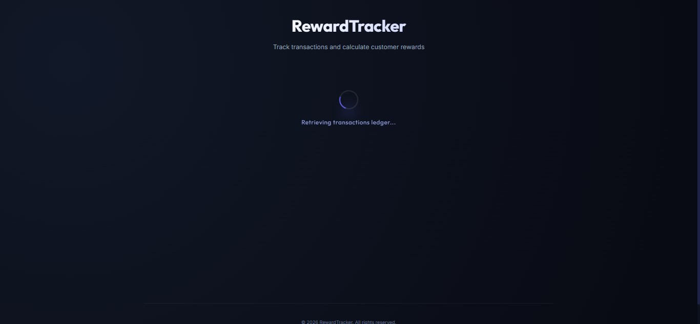
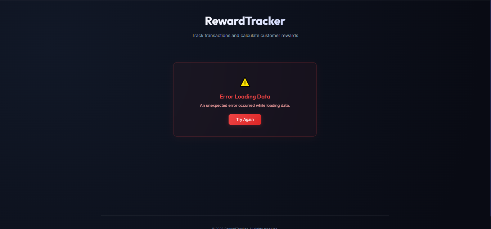
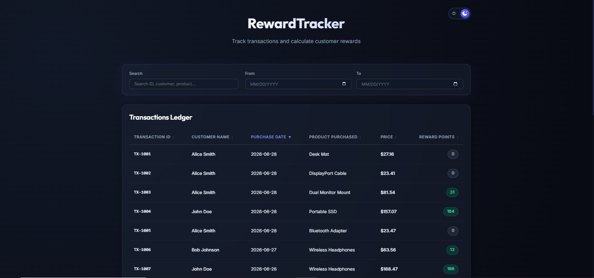
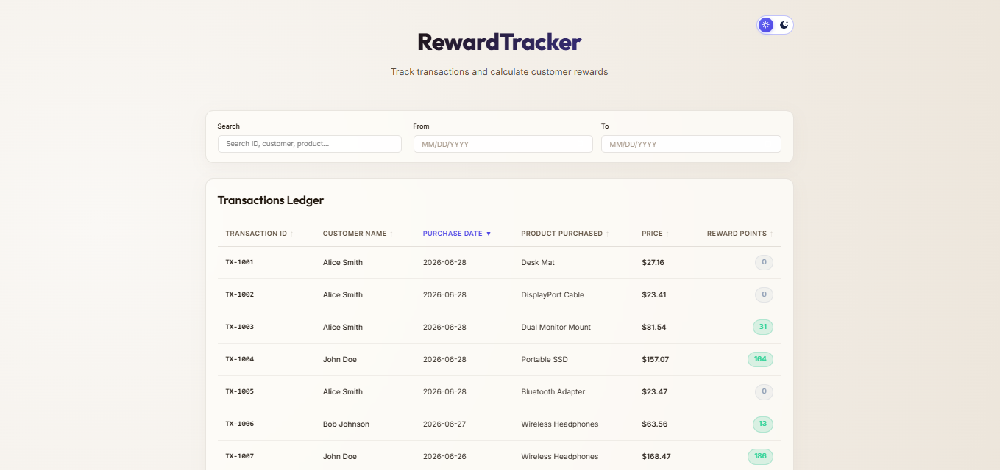
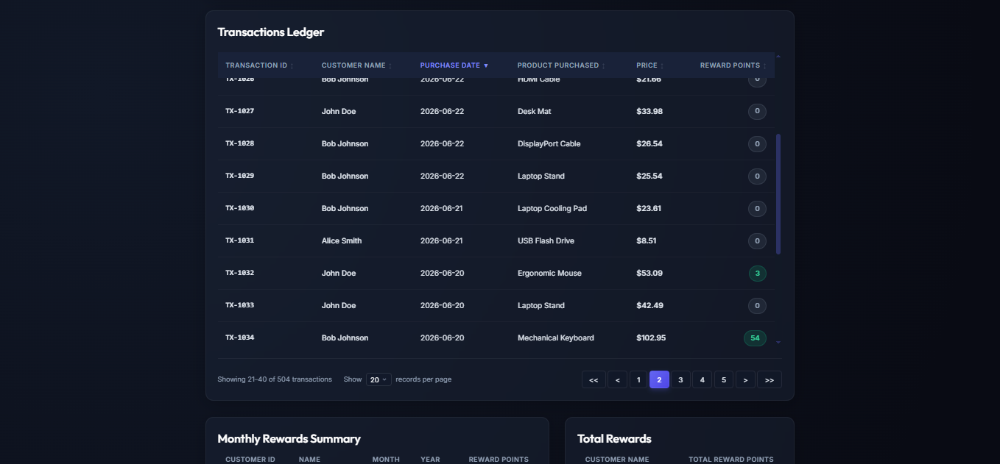
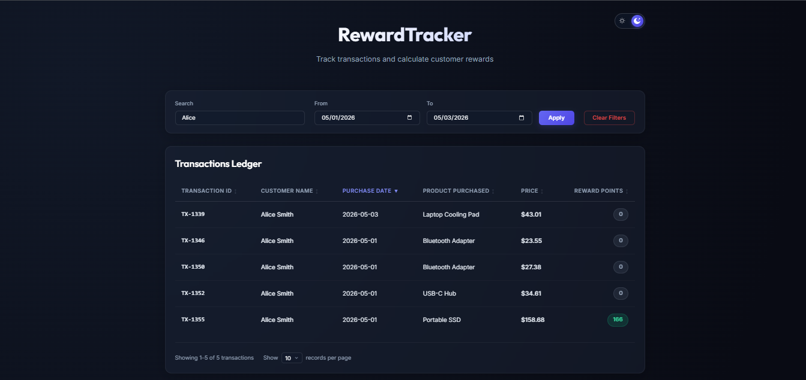
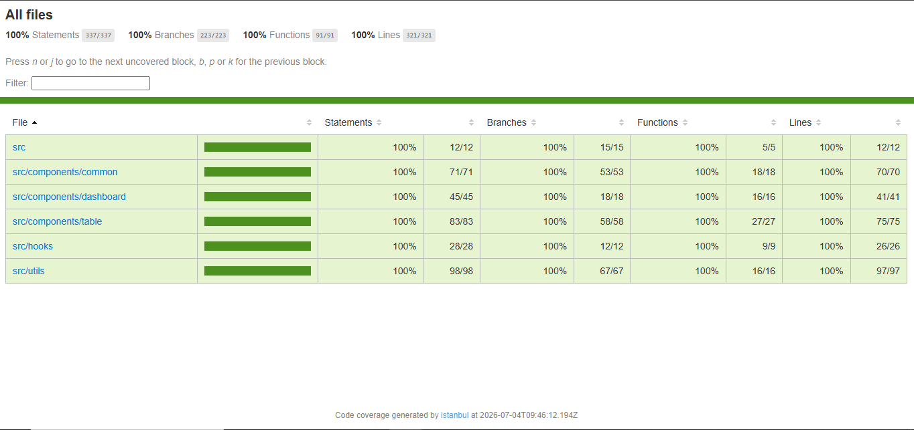

# RewardTracker

RewardTracker is a premium, high-fidelity React dashboard built with Vite that aggregates and tracks customer loyalty points based on retail transaction history over a 3-month period.

## Scenario & Point Rules
A retailer offers a reward program where customers earn points based on individual transactions:
* **2 points** for every dollar spent over **$100** in each transaction.
* **1 point** for every dollar spent between **$50** and **$100** in each transaction.
* *Example*: A $120.00 purchase earns: `2 * ($120 - $100) + 1 * ($100 - $50) = 40 + 50 = 90 points`.

### Decimal & Fraction Handling & Validation
Consistent with the requirement that a purchase of `$100.2` and `$100.4` both yield `50` points, the transaction price is floored to the nearest whole dollar using `Math.floor(price)` first, and reward points are then calculated based on this floored integer price value.
* Price `$100.20` -> floored price: `$100` -> yields `50` points.
* Price `$100.40` -> floored price: `$100` -> yields `50` points.
* Price `$100.80` -> floored price: `$100` -> yields `50` points.
* Price `$101.50` -> floored price: `$101` -> yields `52` points (`2 * ($101 - 100) + 50 = 52`).

**Strict Input Validation**: The points calculation engine performs strict validation. If the transaction price is `null`, `undefined`, `NaN`, or not a `number` type, it throws an `Error('Invalid price value')` rather than returning a fallback value, ensuring complete financial record integrity.

---

## Architectural Highlights & Best Practices
1. **Pure Functions**: Points calculations (`pointsCalculator.js`) and grouping/aggregations (`dataAggregator.js`) are pure functions, ensuring predictable results, testability, and zero side effects.
2. **Immutable Data Patterns**: We avoid array mutations or standard loops (`for`/`forEach`). All data mappings and groupings are built using functional chains with ES6 `.map()`, `.reduce()`, and `.filter()`.
3. **Consolidated State**: Hook-level states for asynchronous operations are combined into a single, clean state object (`{ data, loading, error }`) instead of multiple dispersed `useState` calls.
4. **No Artificial Delays**: We simulate asynchronous data fetching by making a real network request using the browser's native `fetch` API to load the dataset `/transactions.json` under the `/public` directory. Dynamic loading states reflect the actual browser-to-server request lifecycle rather than simulated `setTimeout` delays.
5. **Separated Sorting**: Sorting logic is separated from state. Data is sorted dynamically during rendering, keeping state lightweight and avoiding redundant renders.
6. **Structured Logger**: A custom logging helper (`logger.js`) is used to write development diagnostics and errors, ensuring that no raw `console.log` statements are left in the business code.
7. **Strict Code Quality**: The project is checked against strict ESLint v9 configurations with the React plugin enabled, validating PropTypes for all component parameters, tracking unused variables, and catching raw console statements.
8. **100% Test Coverage**: The project includes unit tests for calculations (handling boundaries and decimals), aggregations, hooks, and interface renderings.

---

## Directory Structure
```text
RewardTracker/
├── public/
│   └── transactions.json     # Mock database (spans Dec 2025 - Feb 2026)
├── src/
│   ├── __tests__/                # Global integration tests
│   │   └── App.test.js
│   ├── components/               # Presentation components (PascalCase)
│   │   ├── common/               # Shared general UI components
│   │   │   ├── ErrorBoundary.js  # Catches rendering crashes and displays errors
│   │   │   ├── ErrorMessage.js   # Styled error panel with retry button
│   │   │   ├── FilterBar.js      # Global transactional input controls
│   │   │   ├── Header.js         # Layout heading branding
│   │   │   └── LoadingSpinner.js # Rotating loader animation
│   │   ├── dashboard/            # Page-level dashboard orchestrator
│   │   │   └── DashboardContent.js
│   │   └── table/                # Table components
│   │       ├── MonthlyRewardsTable.js
│   │       ├── TotalRewardsTable.js
│   │       └── TransactionsTable.js
│   ├── hooks/                    # Custom React hooks (camelCase)
│   │   └── useFetchTransactions.js
│   ├── utils/                    # Pure utility libraries (camelCase)
│   │   ├── dataAggregator.js     # Data processing and sorting utilities
│   │   ├── logger.js             # Environment-safe logger wrapper
│   │   └── pointsCalculator.js   # Main rewards math engine
│   ├── App.css                   # Grid layout stylesheets
│   ├── App.js                    # Central controller coordinate
│   ├── index.css                 # Color scheme, typography, global animations
│   └── main.js                   # React DOM anchor
├── babel.config.cjs              # Babel transpiler rules for Jest
├── eslint.config.js              # ESLint flat configuration (v9 format)
├── jest.config.cjs               # Jest test suite configuration
├── jest.setup.js                 # Testing library setup
└── package.json                  # Dependencies & execution scripts
```

---

## Getting Started

### 1. Installation
Install all developer and dependencies (including Jest, ESLint, React testing utilities, and Babel configurations):
```bash
npm install
```

### 2. Run the Application locally
Start the development server (this will automatically run a production build first to verify compiler checks and bundle assets, then start the Vite local server):
```bash
npm run dev
```
Open [http://localhost:5173](http://localhost:5173) in your web browser.

### 3. Run Automated Unit Tests
Execute the full Jest test suite containing points checks, groupings, and mock hook renderings:
```bash
npm run test
```

### 4. Run ESLint Linting
Verify code quality and style formatting guidelines:
```bash
npm run lint
```

---

## Pagination, Search, Sorting, & Theme Toggle

To handle datasets efficiently while keeping the interface clean and premium, the dashboard implements:
1. **Light/Dark Mode sliding toggle**:
   * **Custom sliding switch**: A premium pill-shaped switch `[ ☀️ | 🌙 ]` rendered in the top-right corner using `/sun.svg` and `/moon.svg` assets from the `public` folder.
   * **Persistent Storage**: Theme choices are persistently stored inside the browser's `localStorage` so that user preferences are maintained and automatically loaded on subsequent page visits.
   * **Warm light theme**: Toggles a `.light-theme` class on the root React theme wrapper component (`.app-theme-wrapper`) to shift the design to a warm ivory/sand background gradient (`#faf8f5` to `#e8dfd2`) with dark charcoal text (`#2d251e`) and warm bronze labels.
2. **Global Interactive Filters & Recalculations**:
   * **Transactional Click-to-Apply Filters**: Search query inputs and date limits are applied simultaneously only when the user clicks the **Apply** button or presses **Enter** inside the search field. This prevents layout changes and heavy re-filtering computations on every keystroke.
   * **Conditional Apply Button Visibility**: The Apply button is hidden by default and is only shown when a filter condition (search query, start date, or end date) has been entered.
   * **Search Input**: Case-insensitive text search matching the **Transaction ID**, **Customer ID**, **Customer Name**, and **Product Name**.
   * **Date Range Selector**: Custom date range filter (`From` and `To` dates) allowing users to filter by any arbitrary timeframe.
   * **Conditional Recalculations**:
     * **Customer Filters**: Searching for a customer name (e.g. `"John"`) or a customer ID (e.g. `"CUST-001"`) filters **all three tables** (Transactions Ledger, Monthly Rewards Summary, and Total Rewards) to display only that customer's summaries.
     * **Product, ID, & Date Filters**: Searching by products, transaction IDs, or choosing a date range filters **only the Transactions Ledger**. The Monthly Rewards Summary and Total Rewards tables remain in a fixed state representing the entire dataset (or the customer's full dataset if a customer filter is active).
3. **Interactive Column Sorting**:
   * **Transactions Ledger**: Every column header is clickable to trigger sorting. Clicking a header toggles between ascending (`▲`) and descending (`▼`) sorting directions, with inactive columns showing (`↕`). Changing the sort key resets the active pagination page to `1`.
   * **Monthly Summary Sorting**: Monthly reward summaries are sorted by **Customer Name** (alphabetically ascending), then **Year** (chronologically ascending), and then **Month** (chronologically ascending).
4. **Flexible Pagination with Sliding Window**:
   * **Page Size Selector**: Dropdown select menu allowing users to change the page size from choices of **10**, **20**, or **30** records per page (defaulting to 10). Toggling size resets the active page to 1.
   * **Sliding Page Window**: Limits the displayed numeric page buttons to a maximum of 5 centered around the active page, preventing layout overflow.
   * **Pagination controls**: Includes page jump buttons `[<<]` (First page), `[<]` (Previous page), sliding numeric buttons, `[>]` (Next page), and `[>>]` (Last page) with disabled states.
5. **Interaction**:
   * Filters are evaluated over the entire dataset first. When search terms or date ranges change, the ledger's active page automatically resets to page `1` to avoid indexing errors.

---

## Interface Previews & Layout

### 1. Loading State
A modern glowing loading animation centered on the screen with the text `"Rendering dashboard tables..."` while the browser's `fetch` resolves the static mock database.



### 2. Error Fallback Panel
A stylized, glassmorphic red panel showing the error message (e.g. `Failed to fetch transactions (HTTP 404)`) and a glowing `"Try Again"` retry button that refreshes React state to trigger a fresh query without full browser page reloads.



### 3. Dark Mode Dashboard (Default)
Uses premium gradient text (`Outfit` font) showing the title **RewardTracker** on a dark radial backdrop, with glassmorphic cards and glowing status badges.



### 4. Light Mode Dashboard (Warmer ivory/sand theme)
Transforms the background gradient, text colors, inputs, table boundaries, and dropdowns to a warm sand-ivory theme utilizing CSS inheritance.



### 5. Pagination Bar
The ledger features a premium pagination controls bar at the footer, showing active pages, item limits, and the records per page dropdown:



### 6. Interactive Filters
The dashboard features global, real-time filters at the top including text search matching multiple fields, and date selectors defining a custom date range. All tables dynamically update in sync.



### 7. Test Coverage
The Jest test suite maintains 100% statement, branch, function, and line coverage across all files:


